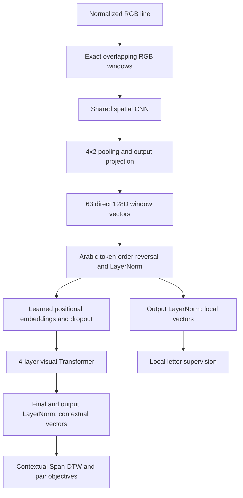

# Yelda: explicit windows and direct CNN vectors

These are experimental variants of the existing branches, preserving each
parent's training settings, text encoder, loss weights and pair behavior.

| Variant | New branch | Parent commit |
| --- | --- | --- |
| Hierarchy | `agent/vlm-letter-depiction-hierarchy-window-cnn` | `9dda4792db397f21ab48495d7b83aab002b8820e` |
| Cross-attention | `agent/vlm-letter-depiction-cross-attention-window-cnn` | `ef0972e55a26b6930389cbff3672fc93474e852c` |

## Image encoder

`window_cnn.py::extract_rgb_windows` explicitly copies full-height RGB windows
without learned parameters or pixel arithmetic. The default window is **128 high
by 32 wide**, with horizontal stride **16**. A 128x1024 line produces 63 windows.
Window values exactly match the corresponding slices of the input tensor. The
existing upstream image preprocessing is unchanged; model-side binarization
remains disabled. Short trailing remainders are omitted, just as in the parent.

The same trainable CNN processes every window, independently of other windows.
All layers remain inside the shared image encoder used for both lines.

| Operation per window | Output shape, excluding batch |
| --- | --- |
| Exact RGB extraction | 3 x 128 x 32 |
| Conv 3x3, stride (2,1), padding 1; GroupNorm; GELU | 16 x 64 x 32 |
| Conv 3x3, stride 2, padding 1; GroupNorm; GELU | 32 x 32 x 16 |
| Conv 3x3, stride 2, padding 1; GroupNorm; GELU | 64 x 16 x 8 |
| Adaptive average pooling to a 4x2 spatial grid | 64 x 4 x 2 |
| Flatten and one Linear(512,128) output projection | 128 |

The final projection is part of the CNN's conversion from a spatial feature map
to its output vector. There is **no additional 128-to-128 depiction MLP** after
that vector. The old head implementation remains available only to reconstruct
legacy checkpoints with `window_cnn_enabled=False`.



RTL reverses the token sequence, not the pixels within a window. Local output
normalization is on a separate output path; contextualization starts from the
CNN tokens after the first LayerNorm. Both parent branches retain the same
local letter-DTW supervision even though the extra depiction head is removed.
Cross-attention still acts on the two independent contextual image sequences.

## Training and freezing

The active optimizer remains `training_optimizations.optimized_train`; the
per-epoch loop remains the override installed by `training_stability.py`.

| Component | Training state |
| --- | --- |
| Window extraction | No parameters; pixel-copy operation |
| CNN, its output projection and visual normalization | Trainable |
| Visual Transformer and position embeddings | Trainable |
| Extra depiction MLP | Absent |
| AraBERT-v02 backbone | Frozen, evaluation mode, forward under no_grad |
| Text projection, LayerNorm, SPACE and BLANK vectors | Trainable, as in parent |
| Image-pair cross-attention in the cross variant | Trainable, as in parent |

Learned CNN weights change the computed features, not the stored source pixels.
The previous full-window convolution also did not mutate source pixels. The new
design makes extraction explicit and adds spatial processing before compression.

The cross variant also fixes the parent's undefined `DEFAULT_ARABIC_LETTERS`
reference in `Parameters.py` by importing the existing inventory constant.
No other training hyperparameters are changed. The two parents already differ
in configuration, so these variants are matched to their respective parents.

## Checkpoints and running

Checkpoints record `window_cnn_enabled`, `window_cnn_architecture`,
`window_extraction` and `letter_depiction_head`. Evaluation reconstructs the
CNN for new checkpoints and the original patch projection/head for old ones.
Original patch-projection weights cannot initialize the new CNN directly;
start these experiments from scratch. Resuming a new CNN checkpoint is supported.

Use a separate checkout/worktree for each running experiment. On the selected
new branch, use the existing training script:

```bash
mkdir -p out
PROJECT_DIR="$PWD" DATASET="/absolute/path/to/Synthetic63" \
  sbatch scripts/train_synthetic63_2x4090.sbatch
```

The default job/output names are `yelda_cnn_hierarchy` and `yelda_cnn_cross`,
respectively. Startup prints `window_cnn = True depiction_mlp=False`.
This change does not launch a cluster job.

## Validation

`tests/test_window_cnn.py` checks exact slices, overlap, storage isolation,
noncontiguous inputs, input gradients, local independence, 63-token output, RTL,
absence of the extra MLP, and checkpoint reconstruction for both encoder types.
It also executes the actual optimized Adam construction and the actual stability
loop with gradient accumulation. CNN, Transformer and text projection weights
must change; backbone weights and source pixels must remain identical. The cross
variant additionally checks an update to pair-attention weights.

That optimizer smoke test replaces only Hugging Face downloads with a small
offline backbone/tokenizer and uses a synthetic differentiable loss. It verifies
the update path, not real-data quality, GPU memory, DDP or JAX Span-DTW execution.

```bash
PYTHONPATH=. python -m pytest tests/test_window_cnn.py \
  tests/test_vit_embedding_model.py tests/test_vit_dense_stride_positions.py -q
```

Pre-existing test limitations discovered during this work: the optimized-config
test imports the removed `split_embeddings` helper; the hierarchy's branch-config
test expects a `num_samples=10000` assignment absent from its parent. These
unrelated stale expectations were not used as evidence about CNN correctness.
